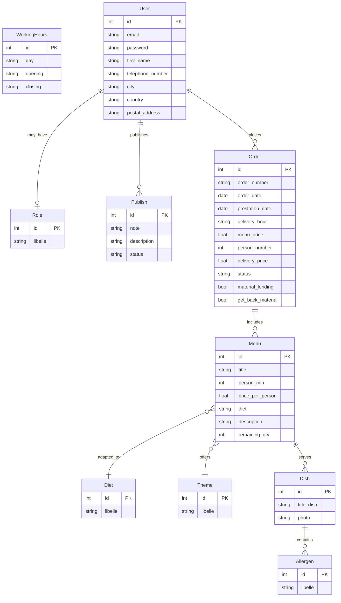

```mermaid
erDiagram

    WorkingHours {
        int id PK
        string day
        string opening
        string closing
    }
    User {
        int id PK
        string email
        string password
        string first_name
        string telephone_number
        string city
        string country
        string postal_address
    }
    Role {
        int id PK
        string libelle
    }
    Publish {
        int id PK
        string note
        string description
        string status
    }
    Order {
        int id PK
        string order_number
        date order_date
        date prestation_date
        string delivery_hour
        float menu_price
        int person_number
        float delivery_price
        string status
        bool material_lending
        bool get_back_material
    }
    Menu {
        int id PK
        string title
        int person_min
        float price_per_person
        string diet
        string description
        int remaining_qty
    }
    Diet {
        int id PK
        string libelle
    }
    Theme {
        int id PK
        string libelle
    }
    Dish {
        int id PK
        string title_dish
        string photo
    }
    Allergen {
        int id PK
        string libelle
    }

    %% Relationships
    User ||--o| Role : "may_have"
    User ||--o{ Publish : "publishes"
    User ||--o{ Order : "places"
    Order ||--o{ Menu : "includes"
    Menu }o--|| Diet : "adapted_to"
    Menu }o--|| Theme : "offers"
    Menu ||--o{ Dish : "serves"
    Dish ||--o{ Allergen : "contains"


```