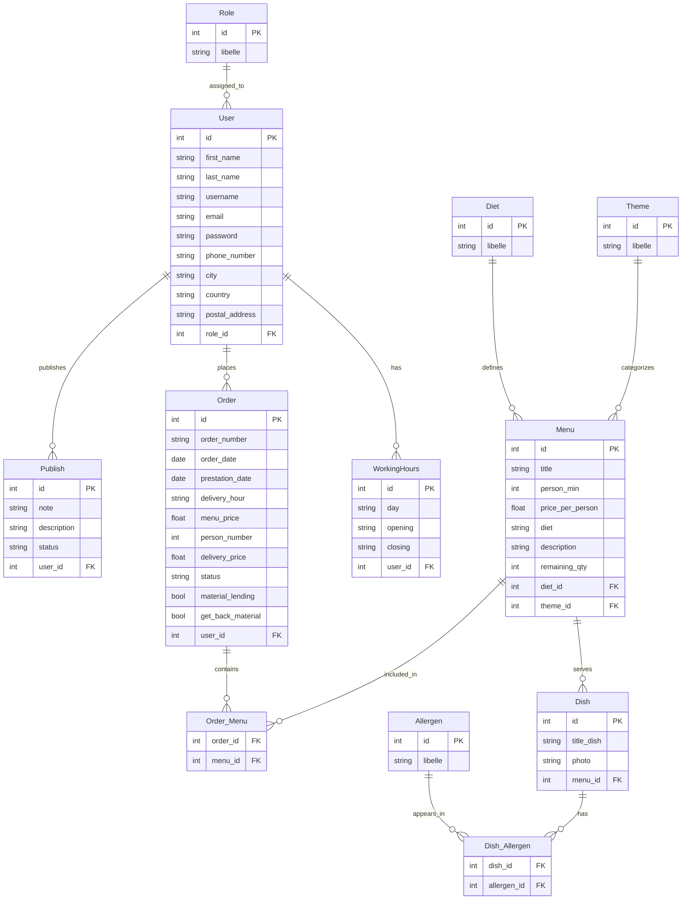

# User

- [ ] the user can have different roles (superadmin, admin, client, employee)
- [ ] The user can publish a menu with a note and a description and the status of the menu (published, draft or archived)

## admin user
- [ ] I need to be able to create, update and delete a menu
- [ ] I need to be able to see the orders and the details of the orders 
- [ ] I need to be able to see the employee performances per profile
- [ ] to be quicker I need to be able to search each employee in a search bar and once found, then click on their profile and see the overview of their details
- [ ] I need to be able to suspend the access to an employee if they are laid off or if they are on vacations
- [ ] I need to be able to track in real time the order and the deliveries of the orders, the business is based on the delivery of the meals, so I need to be able to track the deliveries and the orders in real time to be able to react if there is a problem with the delivery or with the order
- [ ] I need to be able to see the feedbacks of the clients and react to them if needed
- [ ] I need to be able to see the statistics of the sales and the orders
to be alert if there is a problem with the sales or with the orders, or just for monitoring the sales and the orders and money in general
- [ ] I need to be able to see the statistics of the clients and the orders, to be able to see the most ordered meals, the most loyal clients, the most profitable clients, etc...
- [ ] I need to be aware of the stock of menus, and the stocks of the ingredients, to be able to react if there is a problem with the stock, or just for monitoring the stock and the inventory in general
- [ ] I need to be able to see the statistics of the deliveries, to be able to see the most efficient delivery people, the most efficient delivery routes, etc...
- [ ] sometimes in critical moment I might need to have to take over an order and manage it myself, so I need to have my own employee sight access to do the same job as my employees.
- [ ] I need to be able to exchanges messages and receive really quick notifications about message priority per date, per complain, per things taht impact strongly the business,etc.. to be able to react really qickly if there is a problem with the business, or just for monitoring the messages and the notifications in general
- [ ] I need upper rights to be able to change the tables of kanban, add columns, edit columns, add tags, edit tags. To be able to make the business resilinet. The basic ones awaited are (confirmed, in progress, delivering, pending, delivered, cancelled, terminated, etc..)

## super admin user
- [ ] I need to be create a dynamic dashboard that is shared across all the users, but with different access levels, so that I can see the statistics of the sales, the orders, the clients, the deliveries, etc...
- [ ] I can see everything that the admin can see, but I also can work on the program, making it more efficient, more secure, monitoring database and all sensible stuff

## employee user
- [ ] I need to be able to handle the orders, the deliveries, the stock,
the inventory, the clients, the messages, etc...
- [ ] I need a board to manage the orders, prioritize, update status of orders, and be able to communicate with the client the fastest possibly.
- [ ] When a problem arrives, and need to delegate to higher level, I need to be able to send a message to the chain of commnand pushing a ticket issue with a priority level, and the details of the problem, to be able to react really quickly if there is a problem with the business, or just for monitoring the messages and the notifications in general
- [ ] I need to be able to change change the menus, the schedules.
- [ ] I should not be able to annul an order or modify its content before contacting the clinet by GSM or email.
- [ ] I need a filter by order that is available to qukcly retrieve the orders and effecturate (per status) or from a user (client) in specific.
- [ ] The employee should be able to validate the user comment so they can be visible on the website, or just for monitoring the comments and the feedbacks in general..

## client user
- [ ] I should be able to visualize the order details history, or current order details, and be able to moify personal information.
- [ ] Revoke an order or modify its content before the delivery data is possible, as long as an employee didn't confirm the order. Modifying the order is possible for all the items of the order.
- [ ] Once the roder is confirmed, the user can track the order, the tracking tell where the order is with all hte states enumerated, I can see the date and the modiicatoin of the hour updte when modification is done
- [ ] I need to be able to be notified about the `finished`status of the order by mail. When the order is finished, I'm notified by mail to be warned that I can graduate the order and comment it if I want to share my experience with other clients. I should be able to grade between 1 out of 5 stars
- [ ] As a client, to be fidel, I want to have some tracks of my orders, and might want to have some benefits if I order a lot, so I need to be able to see the history of my orders, and the benfits that I can have from each one of them in a credit way. Those information should be seen into the dashboard overview of the client.

## all kind of roles may..
### Order management
- [ ] I need to be able to change my password, my email, my phone numbers, my city, my country, my postal address, etc.. to be able to keep my information up to date and to be able to receive the notifications and the messages in the right way.
- [ ] I shoud be able to order a menu, seeing the button from the detailed view of a menu.
- each user, depending on their role can have differnt kinds of discount or benefits for their orders.
- [ ] we should see the details of the menu by clicking on details. Details will show litterally all the information from the table of teh database menus
    - name, mail first_name of the client (auto completed as we already have them if connected)
    - The address and date of the delivery
    - hour wished
    - contact way phone, email, etc.. (auto completed)
### home page
### menu page
### footer
### portal connexion
### 

