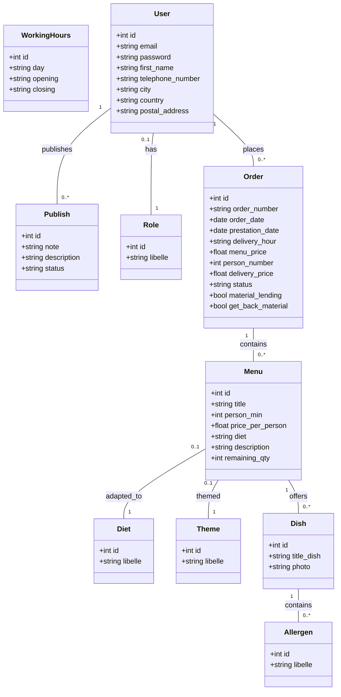

```mermaid
classDiagram
  class WorkingHours {
    +int id
    +string day
    +string opening
    +string closing
  }
  class User {
    +int id
    +string email
    +string password
    +string first_name
    +string telephone_number
    +string city
    +string country
    +string postal_address
  }
  class Publish {
    +int id
    +string note
    +string description
    +string status
  }
  class Role {
    +int id
    +string libelle
  }
  class Order {
    +int id
    +string order_number
    +date order_date
    +date prestation_date
    +string delivery_hour
    +float menu_price
    +int person_number
    +float delivery_price
    +string status
    +bool material_lending
    +bool get_back_material
  }
  class Menu {
    +int id
    +string title
    +int person_min
    +float price_per_person
    +string diet
    +string description
    +int remaining_qty
  }
  class Diet {
    +int id
    +string libelle
  }
  class Theme {
    +int id
    +string libelle
  }
  class Dish {
    +int id
    +string title_dish
    +string photo
  }
  class Allergen {
    +int id
    +string libelle
  }
  User "0..1" -- "1" Role : has
  User "1" -- "0..*" Publish : publishes
  User "1" -- "0..*" Order : places
  Order "1" -- "0..*" Menu : contains
  Menu "1" -- "0..*" Dish : offers
  Menu "0..1" -- "1" Diet : adapted_to
  Menu "0..1" -- "1" Theme : themed
  Dish "1" -- "0..*" Allergen : contains
```