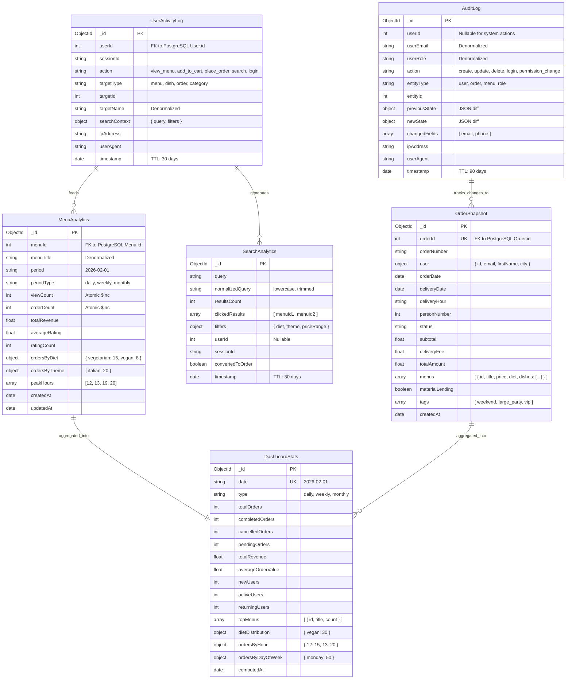

# MongoDB — Analytics & Logging Database

> **Purpose:** Non-transactional, high-write data — user activity tracking, search analytics, dashboard statistics, audit logs, and denormalized order snapshots for fast reads.
> All transactional data lives in [PostgreSQL](./relational_database.md).

---

## Why MongoDB for These Use Cases?

| Criteria | PostgreSQL | MongoDB ✅ |
|----------|-----------|-----------|
| **Activity logs** (high write volume) | Bloats tables, slows queries | Append-only, TTL auto-cleanup |
| **Search analytics** (flexible schema) | Rigid schema, migrations needed | Schema-less, evolves freely |
| **Dashboard stats** (pre-computed) | Requires materialized views | Native aggregation pipeline |
| **Audit trail** (JSON diffs) | JSONB possible but slower | Native document storage |
| **Order snapshots** (denormalized) | Would duplicate relational data | Designed for denormalization |
| **Real-time counters** | Row-level locking | Atomic `$inc` operations |

---

## Data Retention Policy

| Collection | TTL | Rationale |
|-----------|-----|-----------|
| `user_activity_logs` | 30 days | Session data, low long-term value |
| `search_analytics` | 30 days | Search patterns, regenerable |
| `audit_logs` | 90 days | Compliance requirement |
| `order_snapshots` | 180 days | Historical reference |
| `menu_analytics` | 365 days | Business intelligence |
| `dashboard_stats` | 365 days | Year-over-year comparison |

> ⚠️ **Atlas free tier:** 512 MB limit. The service monitors storage at 85% threshold and triggers automatic cleanup by priority.

---

## Collection Schemas



---

## Indexes

```javascript
// menu_analytics
db.menu_analytics.createIndex({ menuId: 1, period: 1 }, { unique: true });
db.menu_analytics.createIndex({ periodType: 1, period: -1 });

// user_activity_logs
db.user_activity_logs.createIndex({ userId: 1, timestamp: -1 });
db.user_activity_logs.createIndex({ sessionId: 1 });
db.user_activity_logs.createIndex({ action: 1, timestamp: -1 });
db.user_activity_logs.createIndex({ timestamp: 1 }, { expireAfterSeconds: 2592000 }); // 30 days

// order_snapshots
db.order_snapshots.createIndex({ orderId: 1 }, { unique: true });
db.order_snapshots.createIndex({ "user.id": 1 });
db.order_snapshots.createIndex({ orderDate: -1 });
db.order_snapshots.createIndex({ status: 1 });

// dashboard_stats
db.dashboard_stats.createIndex({ date: 1, type: 1 }, { unique: true });

// audit_logs
db.audit_logs.createIndex({ entityType: 1, entityId: 1 });
db.audit_logs.createIndex({ userId: 1, timestamp: -1 });
db.audit_logs.createIndex({ timestamp: 1 }, { expireAfterSeconds: 7776000 }); // 90 days

// search_analytics
db.search_analytics.createIndex({ normalizedQuery: 1 });
db.search_analytics.createIndex({ timestamp: -1 });
db.search_analytics.createIndex({ timestamp: 1 }, { expireAfterSeconds: 2592000 }); // 30 days
```

---

## Aggregation Pipelines

```javascript
// Top 10 most ordered menus this month
db.menu_analytics.aggregate([
  { $match: { periodType: "monthly", period: "2026-02" } },
  { $sort: { orderCount: -1 } },
  { $limit: 10 },
  { $project: { menuTitle: 1, orderCount: 1, totalRevenue: 1, averageRating: 1 } }
]);

// Peak ordering hours this week
db.order_snapshots.aggregate([
  { $match: { orderDate: { $gte: new Date("2026-02-03") } } },
  { $group: { _id: { $hour: "$orderDate" }, count: { $sum: 1 } } },
  { $sort: { count: -1 } }
]);

// Search queries that never convert to orders
db.search_analytics.aggregate([
  { $match: { convertedToOrder: false } },
  { $group: { _id: "$normalizedQuery", count: { $sum: 1 } } },
  { $sort: { count: -1 } },
  { $limit: 20 }
]);

// User journey: what actions lead to orders
db.user_activity_logs.aggregate([
  { $match: { action: "place_order" } },
  { $lookup: {
      from: "user_activity_logs",
      let: { uid: "$userId", ts: "$timestamp" },
      pipeline: [
        { $match: { $expr: { $and: [
          { $eq: ["$userId", "$$uid"] },
          { $lt: ["$timestamp", "$$ts"] },
          { $gt: ["$timestamp", { $subtract: ["$$ts", 3600000] }] }
        ]}}}
      ],
      as: "prior_actions"
  }},
  { $unwind: "$prior_actions" },
  { $group: { _id: "$prior_actions.action", count: { $sum: 1 } } },
  { $sort: { count: -1 } }
]);
```

---

## Data Flow: PostgreSQL ↔ MongoDB

```
┌─────────────────────┐         ┌─────────────────────┐
│     PostgreSQL      │         │      MongoDB         │
│  (Source of Truth)  │         │   (Analytics Layer)  │
├─────────────────────┤         ├─────────────────────┤
│                     │         │                     │
│  User creates order ├────────►│  OrderSnapshot      │
│                     │  sync   │  (denormalized)     │
│  Order status       ├────────►│  DashboardStats     │
│  changes            │  event  │  (aggregated)       │
│                     │         │                     │
│  Menu published     ├────────►│  MenuAnalytics      │
│                     │  event  │  (view/order count) │
│                     │         │                     │
│  User logs in       ├────────►│  UserActivityLog    │
│                     │  event  │  AuditLog           │
│                     │         │                     │
│  ◄── Query results ─┤         │  Search, Dashboard  │
│  (for display only) │◄────────┤  pre-computed       │
│                     │  read   │                     │
└─────────────────────┘         └─────────────────────┘
```

> **Rule:** PostgreSQL is always the source of truth. MongoDB holds derived, expendable data. If MongoDB goes down, the application still works — analytics features are just unavailable.
