# PostgreSQL — Relational Database Schema

> **Purpose:** All transactional, ACID-compliant data — users, orders, menus, reviews, messaging, loyalty, GDPR compliance.
> Analytics, activity logs, and search tracking live in [MongoDB](./nosql_database.md).

---

## Design Principles

| Principle | Implementation |
|-----------|---------------|
| **Normalization** | Each entity in its own table; junction tables for M:N |
| **Referential Integrity** | Foreign keys with `ON DELETE CASCADE` or `SET NULL` |
| **Soft Deletion** | `is_deleted` + `deleted_at` columns instead of hard delete |
| **Audit Trail** | `created_at`, `updated_at` on every mutable table |
| **GDPR by Design** | Consent tracking, data export, anonymization support |
| **Index Strategy** | Composite indexes on frequent query patterns |
| **Prepared Statements** | All queries parameterized (Prisma handles this) |

---

## Entity-Relationship Diagram

```mermaid
erDiagram

    %% ========================================
    %% AUTHENTICATION & AUTHORIZATION
    %% ========================================

    User {
        int id PK "SERIAL"
        string email UK "Indexed, login identifier"
        string password_hash "Bcrypt, min 12 rounds"
        string first_name "NOT NULL"
        string last_name
        string phone_number
        string city
        string country
        string postal_code
        int role_id FK "NOT NULL"
        boolean is_active "DEFAULT true"
        boolean is_email_verified "DEFAULT false"
        boolean is_deleted "Soft delete flag"
        datetime deleted_at
        string preferred_language "DEFAULT 'fr'"
        datetime created_at "DEFAULT now()"
        datetime updated_at "Auto-updated"
        datetime last_login_at
    }

    Role {
        int id PK "SERIAL"
        string name UK "superadmin, admin, employee, client"
        string description
        datetime created_at
    }

    Permission {
        int id PK "SERIAL"
        string name UK "e.g. manage_orders"
        string resource "orders, menus, users, reviews"
        string action "create, read, update, delete"
    }

    RolePermission {
        int role_id FK
        int permission_id FK
    }

    UserAddress {
        int id PK "SERIAL"
        int user_id FK "ON DELETE CASCADE"
        string label "Home, Work, Other"
        string street_address "NOT NULL"
        string city "NOT NULL"
        string postal_code "NOT NULL"
        string country "NOT NULL"
        float latitude "For delivery optimization"
        float longitude
        boolean is_default "DEFAULT false"
        datetime created_at
    }

    PasswordResetToken {
        int id PK "SERIAL"
        string token UK "Hashed"
        int user_id FK "ON DELETE CASCADE"
        datetime expires_at
        boolean used "DEFAULT false"
        datetime created_at
    }

    UserSession {
        int id PK "SERIAL"
        int user_id FK "ON DELETE CASCADE"
        string session_token UK
        string ip_address
        string user_agent
        datetime created_at
        datetime expires_at
        boolean is_active "DEFAULT true"
    }

    %% ========================================
    %% GDPR & CONSENT
    %% ========================================

    UserConsent {
        int id PK "SERIAL"
        int user_id FK "ON DELETE CASCADE"
        string consent_type "marketing, analytics, cookies"
        boolean is_granted
        datetime granted_at
        datetime revoked_at
        string ip_address "Proof of consent"
    }

    DataDeletionRequest {
        int id PK "SERIAL"
        int user_id FK "ON DELETE SET NULL"
        string reason
        string status "pending, approved, completed, rejected"
        datetime requested_at "DEFAULT now()"
        datetime processed_at
        int processed_by FK "Admin who handled it"
    }

    %% ========================================
    %% MENU MANAGEMENT
    %% ========================================

    Menu {
        int id PK "SERIAL"
        string title "NOT NULL, indexed for search"
        text description
        int person_min "CHECK > 0"
        decimal price_per_person "DECIMAL(10,2), CHECK > 0"
        int remaining_qty "CHECK >= 0"
        string status "draft, published, archived"
        int diet_id FK
        int theme_id FK
        int created_by FK "User who created it"
        boolean is_seasonal "DEFAULT false"
        date available_from
        date available_until
        datetime created_at
        datetime updated_at
        datetime published_at
    }

    MenuImage {
        int id PK "SERIAL"
        int menu_id FK "ON DELETE CASCADE"
        string image_url "NOT NULL"
        string alt_text
        int display_order "DEFAULT 0"
        boolean is_primary "DEFAULT false"
        datetime uploaded_at
    }

    Diet {
        int id PK "SERIAL"
        string name UK "Classique, Végétarien, Végan, etc."
        string description
        string icon_url
    }

    Theme {
        int id PK "SERIAL"
        string name UK "Mariage, Entreprise, Cocktail, etc."
        string description
        string icon_url
    }

    Dish {
        int id PK "SERIAL"
        int menu_id FK "ON DELETE CASCADE"
        string title "NOT NULL"
        text description
        string photo_url
        int course_order "1=entrée, 2=plat, 3=dessert"
        datetime created_at
    }

    Allergen {
        int id PK "SERIAL"
        string name UK "14 EU allergens"
        string icon_url
    }

    DishAllergen {
        int dish_id FK "ON DELETE CASCADE"
        int allergen_id FK "ON DELETE CASCADE"
    }

    Ingredient {
        int id PK "SERIAL"
        string name UK
        string unit "kg, litres, pièces"
        decimal current_stock "DECIMAL(10,2)"
        decimal min_stock_level "Alert threshold"
        decimal cost_per_unit "DECIMAL(10,2)"
        datetime last_restocked_at
    }

    MenuIngredient {
        int menu_id FK "ON DELETE CASCADE"
        int ingredient_id FK "ON DELETE CASCADE"
        decimal quantity_per_person "DECIMAL(10,3)"
    }

    %% ========================================
    %% ORDER LIFECYCLE
    %% ========================================

    Order {
        int id PK "SERIAL"
        string order_number UK "ORD-YYYY-NNNNN, indexed"
        int user_id FK "Client who placed it"
        int delivery_address_id FK
        datetime order_date "DEFAULT now(), indexed"
        date delivery_date "NOT NULL"
        string delivery_time_slot "e.g. 12h-14h"
        decimal subtotal "DECIMAL(10,2)"
        decimal delivery_fee "DECIMAL(10,2)"
        decimal discount_amount "DECIMAL(10,2) DEFAULT 0"
        decimal tax_amount "DECIMAL(10,2)"
        decimal total_amount "DECIMAL(10,2)"
        string status "pending, confirmed, preparing, delivering, delivered, cancelled, refunded"
        text special_instructions
        boolean material_lending "DEFAULT false"
        boolean material_returned "DEFAULT false"
        int assigned_to FK "Employee handling it"
        int discount_id FK "Applied promo code"
        datetime confirmed_at
        datetime delivered_at
        datetime cancelled_at
        string cancellation_reason
        datetime created_at
        datetime updated_at
    }

    OrderItem {
        int id PK "SERIAL"
        int order_id FK "ON DELETE CASCADE"
        int menu_id FK
        int quantity "Number of persons"
        decimal unit_price "Snapshot at time of order"
        decimal line_total "quantity * unit_price"
        text special_requests
    }

    OrderStatusHistory {
        int id PK "SERIAL"
        int order_id FK "ON DELETE CASCADE"
        string old_status
        string new_status "NOT NULL"
        string notes
        int changed_by FK "User who changed it"
        datetime changed_at "DEFAULT now()"
    }

    %% ========================================
    %% DELIVERY
    %% ========================================

    DeliveryAssignment {
        int id PK "SERIAL"
        int order_id FK "ON DELETE CASCADE"
        int delivery_person_id FK "Employee user"
        string vehicle_type "bike, scooter, car"
        string status "assigned, picked_up, in_transit, delivered, failed"
        datetime assigned_at "DEFAULT now()"
        datetime picked_up_at
        datetime delivered_at
        text delivery_notes
        string proof_photo_url
        int client_rating "1-5, nullable"
    }

    %% ========================================
    %% REVIEWS & MODERATION
    %% ========================================

    Review {
        int id PK "SERIAL"
        int order_id FK "ON DELETE SET NULL"
        int user_id FK "ON DELETE CASCADE"
        int menu_id FK "ON DELETE SET NULL"
        int rating "CHECK BETWEEN 1 AND 5"
        text comment
        boolean is_approved "DEFAULT false"
        int moderated_by FK "Employee or Admin"
        datetime moderated_at
        datetime created_at
        datetime updated_at
    }

    ReviewImage {
        int id PK "SERIAL"
        int review_id FK "ON DELETE CASCADE"
        string image_url "NOT NULL"
        datetime uploaded_at
    }

    %% ========================================
    %% LOYALTY & PROMOTIONS
    %% ========================================

    LoyaltyAccount {
        int id PK "SERIAL"
        int user_id FK "ON DELETE CASCADE, one per user"
        int total_earned
        int total_spent
        int balance "Computed: earned - spent"
        datetime last_activity_at
    }

    LoyaltyTransaction {
        int id PK "SERIAL"
        int loyalty_account_id FK "ON DELETE CASCADE"
        int order_id FK "ON DELETE SET NULL"
        int points "Positive=earn, Negative=spend"
        string type "earn, redeem, expire, bonus"
        text description
        datetime created_at
    }

    Discount {
        int id PK "SERIAL"
        string code UK "Promo code"
        string description
        string type "percentage, fixed_amount"
        decimal value "DECIMAL(10,2)"
        decimal min_order_amount "DECIMAL(10,2)"
        int max_uses "NULL = unlimited"
        int current_uses "DEFAULT 0"
        date valid_from
        date valid_until
        boolean is_active "DEFAULT true"
        int created_by FK "Admin who created it"
    }

    %% ========================================
    %% EMPLOYEE MANAGEMENT
    %% ========================================

    WorkingHours {
        int id PK "SERIAL"
        int user_id FK "ON DELETE CASCADE"
        string day_of_week "monday..sunday"
        time start_time
        time end_time
        boolean is_available "DEFAULT true"
    }

    TimeOffRequest {
        int id PK "SERIAL"
        int user_id FK "ON DELETE CASCADE"
        date start_date
        date end_date
        string type "vacation, sick, personal"
        string status "pending, approved, rejected"
        text reason
        int decided_by FK "Admin"
        datetime requested_at "DEFAULT now()"
        datetime decided_at
    }

    %% ========================================
    %% MESSAGING & SUPPORT
    %% ========================================

    Message {
        int id PK "SERIAL"
        int sender_id FK "ON DELETE SET NULL"
        int recipient_id FK "ON DELETE SET NULL"
        string subject
        text body "NOT NULL"
        string priority "low, normal, high, urgent"
        boolean is_read "DEFAULT false"
        datetime sent_at "DEFAULT now()"
        datetime read_at
        int parent_id FK "Thread reply"
    }

    Notification {
        int id PK "SERIAL"
        int user_id FK "ON DELETE CASCADE"
        string type "order_update, delivery, promo, system, review"
        string title
        text body
        string link_url
        boolean is_read "DEFAULT false"
        datetime created_at "DEFAULT now()"
        datetime read_at
    }

    SupportTicket {
        int id PK "SERIAL"
        string ticket_number UK "TKT-YYYY-NNNNN"
        int created_by FK "ON DELETE SET NULL"
        int assigned_to FK "ON DELETE SET NULL"
        string category "order, payment, delivery, account, other"
        string priority "low, normal, high, urgent"
        string status "open, in_progress, waiting, resolved, closed"
        string subject "NOT NULL"
        text description
        datetime created_at "DEFAULT now()"
        datetime resolved_at
        datetime closed_at
    }

    TicketMessage {
        int id PK "SERIAL"
        int ticket_id FK "ON DELETE CASCADE"
        int user_id FK "ON DELETE SET NULL"
        text body "NOT NULL"
        boolean is_internal "Staff-only note"
        datetime created_at "DEFAULT now()"
    }

    %% ========================================
    %% KANBAN CONFIGURATION
    %% ========================================

    KanbanColumn {
        int id PK "SERIAL"
        string name "NOT NULL"
        string mapped_status "Order status it represents"
        string color "Hex color"
        int position "Display order"
        boolean is_active "DEFAULT true"
        int created_by FK
        datetime created_at
    }

    OrderTag {
        int id PK "SERIAL"
        string label UK "urgent, vip, fragile, etc."
        string color "Hex color"
        int created_by FK
    }

    OrderOrderTag {
        int order_id FK "ON DELETE CASCADE"
        int tag_id FK "ON DELETE CASCADE"
    }

    %% ========================================
    %% RELATIONSHIPS
    %% ========================================

    %% Auth & Users
    Role ||--o{ User : "has"
    Role ||--o{ RolePermission : "grants"
    Permission ||--o{ RolePermission : "assigned_via"
    User ||--o{ UserAddress : "has"
    User ||--o{ UserSession : "has"
    User ||--o{ PasswordResetToken : "requests"
    User ||--o{ UserConsent : "gives"
    User ||--o{ DataDeletionRequest : "requests"

    %% Menus
    Diet ||--o{ Menu : "categorizes"
    Theme ||--o{ Menu : "categorizes"
    User ||--o{ Menu : "creates"
    Menu ||--o{ MenuImage : "has"
    Menu ||--o{ Dish : "contains"
    Menu ||--o{ MenuIngredient : "requires"
    Ingredient ||--o{ MenuIngredient : "used_in"
    Dish ||--o{ DishAllergen : "has"
    Allergen ||--o{ DishAllergen : "flags"

    %% Orders
    User ||--o{ Order : "places"
    UserAddress ||--o{ Order : "delivered_to"
    User ||--o{ Order : "assigned_to employee"
    Discount ||--o{ Order : "applied_to"
    Order ||--o{ OrderItem : "contains"
    Menu ||--o{ OrderItem : "included_in"
    Order ||--o{ OrderStatusHistory : "tracked_by"
    User ||--o{ OrderStatusHistory : "changed_by"
    Order ||--o{ OrderOrderTag : "tagged_with"
    OrderTag ||--o{ OrderOrderTag : "applied_to"

    %% Delivery
    User ||--o{ DeliveryAssignment : "delivers"
    Order ||--o{ DeliveryAssignment : "fulfilled_by"

    %% Reviews
    Order ||--o{ Review : "reviewed_in"
    User ||--o{ Review : "writes"
    Menu ||--o{ Review : "receives"
    User ||--o{ Review : "moderates"
    Review ||--o{ ReviewImage : "has"

    %% Loyalty
    User ||--o{ LoyaltyAccount : "has"
    LoyaltyAccount ||--o{ LoyaltyTransaction : "records"
    Order ||--o{ LoyaltyTransaction : "triggers"
    User ||--o{ Discount : "creates admin"

    %% Employee
    User ||--o{ WorkingHours : "has"
    User ||--o{ TimeOffRequest : "requests"
    User ||--o{ TimeOffRequest : "decides admin"

    %% Messaging
    User ||--o{ Message : "sends"
    User ||--o{ Message : "receives"
    User ||--o{ Notification : "notified"
    User ||--o{ SupportTicket : "creates"
    User ||--o{ SupportTicket : "assigned_to"
    SupportTicket ||--o{ TicketMessage : "has"
    User ||--o{ TicketMessage : "writes"

    %% Kanban
    User ||--o{ KanbanColumn : "configures"
    User ||--o{ OrderTag : "creates"
``` 

